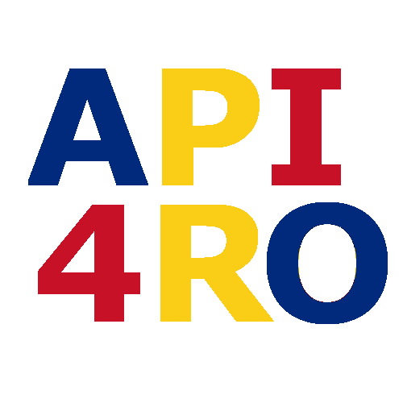

# api4ro [[en]](./README.en.md)

Un set de programe care construiesc API-urile lipsă pentru platformele guvernamentale românești.

## Ideea din spate
Până și cele mai bine făcute website-uri guvernamentale românești duc lipsa API-urilor, ceea ce ne împiedică să automatizăm anumite procese, să analizăm date guvernmentale și legi sau să construim aplicații deasupra acelor date.

Principala problemă nu este neaparat faptul că guvernul nu ne dă access la informații. Dar o face într-o manieră care este relativ accesibilă pentru oameni, dar foarte greu accesibilă programatic, ceea ce ne împiedică a face analize în masă a acestor date.

Așadar, acest proiect extrage toate informațiile posibile de pe anumite website-uri guvernamentale de interes și le stochează într-un format ușor stochabil în baze de date și, prin consecință, ușor accesibil din punct de vedere programatic.

## Ce tehnologii sunt folosite?
Acest program este scris în python. Partea de scraping folosește [scrapy](https://scrapy.org/), așa că este recomandată familiarizarea cu acest proiect ([documentație](https://docs.scrapy.org/)).

## Comunitate
Am creeat un [server de discord](https://discord.gg/aBax3GrXnP) pentru coordonarea contribuitorilor. Pentru contact directe, prefer folosirea email-ului (`mark@markveres.ro`) sau a aplicației de mesagerie Signal (`markveres.01`)